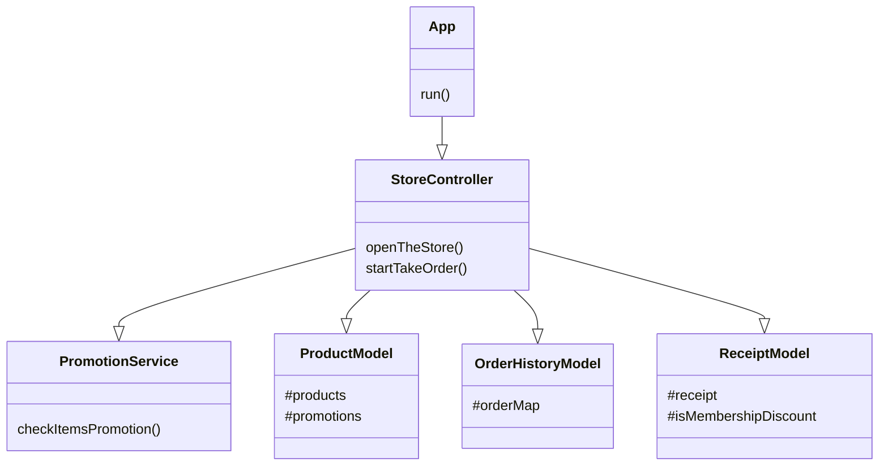

# javascript-convenience-store-precourse

## 🏄🏼‍♂️ 프로젝트 소개

우테코 마을에는 한 편의점이 있습니다.

이 편의점에서 재고를 잘 파악하고 있는 한 직원과, 편의점에 간식을 사러온 한 손님이 있습니다.

이들의 이야기가 이제 시작됩니다.

```

직원이 편의점 문을 활짝 열며 인사를 합니다. 그리고 오늘의 재고를 이야기합니다.

한 손님이 들어와 주문을 시작합니다. 여러 주문을 잊지 않기 위해 주문지에 작성하고 있습니다.

친절한 편의점 직원은 빠뜨린 프로모션 제품이 있을까봐 손님에게 이를 물어봅니다.

꼼꼼한 편의점 직원은 멤버십 할인까지 챙겨줍니다.

일 잘하는 편의점 직원은 영수증을 손님에게 보여줍니다.

장사 잘하는 편의점 직원은 더 주문을 할 지 손님에게 물어봅니다.

```

이렇게 한 이야기가 끝이 납니다. 이 이야기를 코드로 풀어낸 것이 [App](./src/App.js)과 [Store](./src/controllers/StoreController.js)입니다.

## 🤸‍♀️ 코드 설명

### 1. MVC패턴

> MVC패턴
> : Controller가 주축이 되어, Model과 View를 연결한다. Model은 데이터에 대한 관리만, View는 사용자의 입출력만을 담당한다.
>
> 1. Model은 View와 Controller에 의존하지 않는다.
> 2. View는 필요에 따라 Model를 주입받을 수 있으며, Controller에 의존하지 않는다.
> 3. Controller는 Model과 View을 이용하여 프로그램의 흐름을 담당한다.

이번 과제에서는 MVC패턴을 적용했습니다. 객체들, 특히 제품과 주문 목록간의 의존성이 너무 강해서 이를 하나의 모델에서 수행하기에는 어렵다고 판단하였습니다. 왜냐하면 하나의 모델에서 특정 행위를 수행하면, 다른 모델을 반드시 메서드의 인자로 넘겨주어야 하기 때문입니다. 그래서 이 제품과 주문 목록을 Product와 OrderHistory라는 모델로 분리를 하고, Controller에서 이를 제어하도록 하였습니다.

이렇게 MVC패턴으로 각 객체를 분리하고 나니 Controller가 대단히 무거워졌습니다. 그래서, 프로모션에 대한 로직을 PromotionService라는 서비스 계층으로 분리하여 Controller의 책임을 분산했습니다.

1. [Model](./src/models/) : 데이터를 담당합니다.

   1. ProductModel : 상품에 대한 데이터를 담고 있는 객체입니다.
   2. OrderHistoryModel : 주문 목록에 대한 데이터를 담고 있는 객체입니다.
   3. ReceiptModel : 영수증에 필요한 데이터를 담고 있는 객체입니다.

2. [View](./src/views/) : 사용자의 입출력만을 담당합니다.

   1. FileView : 파일을 읽는 객체입니다.
   2. InputView : 사용자로부터 입력을 받는 객체입니다.
   3. OutputView : 사용자로에게 결과를 출력하는 객체입니다.

3. [Controller](./src/controllers/) : Model과 View를 연결하여 프로그램의 전체적인 흐름을 담당합니다.

   1. StoreController : 편의점의 전반적인 흐름을 담당하는 객체입니다.

4. [Service](./src/services/) : Controller의 책임을 덜어줍니다.

   1. PromotionService : 편의점에서 프로모션 관련된 로직을 담당하는 객체입니다.

5. [helpers](./src/helpers/) : 핼퍼 객체이며, 주로 View에서 필요한 기능을 담당합니다.
   1. FileParser : 파일 입력을 받았을 때 이를 가공하는 객체입니다.
   2. InputParser : 사용자의 입력을 받았을 때 이를 가공하는 객체입니다.
   3. InputValidator : 사용자의 입력을 받았을 때 유효성 검사하는 객체입니다.

### 2. 테스트

App의 테스트 코드는 **tests**폴더에 있고, 그 외의 테스트 코드는 각 파일이 위치한 폴더에 함께 위치해있습니다. 이렇게 테스트 코드 파일과 메인 파일을 함께 둔 이유는 응집성때문입니다. 이 둘이 멀리 떨어져있으면 물리적으로 떨어져 더 손이 안가게되고, 점점 관리를 안하게 될 것이라 판단하여 같은 폴더에 배치했습니다.

클래스에 대한 테스트 코드는 Model에 대한 테스트만 작성했습니다. Controller와 View는 다른 객체와의 의존성이 너무 강하고, 애플리케이션에 대한 테스트로 충분히 대체가 가능하다고 생각했습니다.

### 3. 라이브러리

lib 폴더에서 확인할 수 있습니다. 애플리케이션 혹은 테스트에 필요한 유틸이나 상수를 보관합니다.

1. [constants](./src/lib/constants.js) : 애플리케이션에서 사용하는 상수
2. [utils](./src/lib/utils.js) : 애플리케이션에서 사용하는 유틸 함수
3. [test/utils](./src/lib/test/utils.js) : 테스트할 때 모킹에 필요한 유틸 함수

## 🔨 기능 구현 목록

1. 구현에 필요한 상품 목록과 행사 목록을 파일 입출력을 통해 불러온다.

   - `public/products.md`와 `public/promotion.md`파일을 이용한다.

2. 환영 인사와 함께 상품명, 가격, 프로모션 이름, 재고를 안내한다. 만약 재고가 0개라면 `재고 없음`을 출력한다.

   ```
   안녕하세요. W편의점입니다.
   현재 보유하고 있는 상품입니다.

     - 콜라 1,000원 10개 탄산2+1
     - 콜라 1,000원 10개
     - 사이다 1,000원 8개 탄산2+1
     - 사이다 1,000원 7개
     - 오렌지주스 1,800원 9개 MD추천상품
     - 오렌지주스 1,800원 재고 없음
     - 탄산수 1,200원 5개 탄산2+1
     - 탄산수 1,200원 재고 없음
     - 물 500원 10개
     - 비타민워터 1,500원 6개
     - 감자칩 1,500원 5개 반짝할인
     - 감자칩 1,500원 5개
     - 초코바 1,200원 5개 MD추천상품
     - 초코바 1,200원 5개
     - 에너지바 2,000원 5개
     - 정식도시락 6,400원 8개
     - 컵라면 1,700원 1개 MD추천상품
     - 컵라면 1,700원 10개

   ```

3. 상품의 가격과 수량을 입력받는다.
   ```
   구매하실 상품명과 수량을 입력해 주세요. (예: [사이다-2],[감자칩-1])
   ```
   - [예외] 입력한 수량이 상품의 개수보다 많을 경우
   - [예외] 입력한 수량이 양의 정수가 아닌 경우
   - [예외] 없는 상품을 입력한 경우
   - [예외] `[상품명-수량],[상품명-수량]`과 같은 형식으로 작성하지 않았을 경우
4. 입력받은 상품을 기반으로 프로모션 정보를 확인한다.

   - 조건 1. 해당 상품에 대한 프로모션이 존재한다.
   - 조건 2. 현재 기간에 해당하는 프로모션이어야 한다.

   1. 프로모션 적용이 가능한 상품에 대해 고객이 해당 수량만큼 가져오지 않았을 경우, 혜택에 대한 안내 메시지를 출력한다.
      ```
      현재 {상품명}은(는) 1개를 무료로 더 받을 수 있습니다. 추가하시겠습니까? (Y/N)
      ```
      - 조건 1. (현재 상품 개수 + 1) % 프로모션 단위(2+1의 경우 3, 1+1의 경우 2) = 0
      - 조건 2. 현재 상품 개수 + 1의 상품을 가지고 있어야 한다. // 체크
   2. 프로모션 재고가 부족하여 일부 수량을 프로모션 혜택 없이 결제해야 하는 경우, 일부 수량에 대해 정가로 결제할지 여부에 대한 안내 메시지를 출력한다.
      ```
      현재 {상품명} {수량}개는 프로모션 할인이 적용되지 않습니다. 그래도 구매하시겠습니까? (Y/N)
      ```
      - 프로모션 가능 상품 개수 = Math.floor(프로모션 상품 개수 / 프로모션 단위) \* 프로모션 단위
      - 프로모션 할인이 적용되지 않는 수량 = 구매 상품 개수 - 프로모션 가능 상품 개수
      - 조건 1. 구매 상품 개수 > 프로모션 가능 상품 개수

5. 멤버십 할인 적용 여부를 확인하기 위해 안내 문구를 출력한다.

   ```
   멤버십 할인을 받으시겠습니까? (Y/N)
   ```

   - 멤버십 회원은 프로모션 미적용 금액의 30%를 할인받는다.
   - 프로모션 적용 후 남은 금액에 대해 멤버십 할인을 적용한다.
   - 멤버십 할인의 최대 한도는 8,000원이다.

6. 구매 상품 내역, 증정 상품 내역, 금액 정보를 출력한다.

   ```
   ===========W 편의점=============
   상품명		수량	금액
   콜라		3 	3,000
   에너지바 		5 	10,000
   ===========증	정=============
   콜라		1
   ==============================
   총구매액		8	13,000
   행사할인			-1,000
   멤버십할인			-3,000
   내실돈			 9,000

   ```

   - 증정 개수 = Math.floor(Math.min(프로모션 상품 개수, 구매 상품 개수) / 프로모션 단위)
   - 총구매액 = (상품 개수 \* 상품 가격)의 합
   - 행사할인 = (증정 개수 \* 상품 가격)의 합
   - 멤버십할인 = ((상품 개수 - 행사에 적용된 상품의 개수) \* 상품가격)의 합
   - 내실돈 = 총구매액 - 행사할인 - 멤버십할인

7. 추가 구매 여부를 입력 받는다.
   ```
   감사합니다. 구매하고 싶은 다른 상품이 있나요? (Y/N)
   ```

## 클래스 다이어그램



## 더 알아보기

🤸‍♂️ 제 4주차 과제에서 어떤 점을 고민했고, 무엇을 배웠는지에 대한 이야기가 궁금하신가요?

[노션](https://guesung.notion.site/4-13389de02fde8068a6a7c668d808bffd?pvs=73)에서 더 자세한 내용을 확인하실 수 있습니다 !
